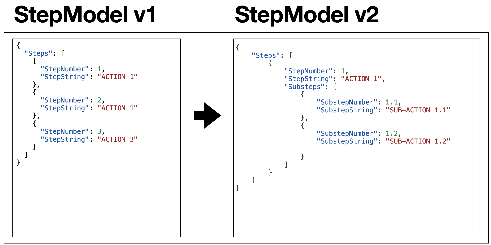
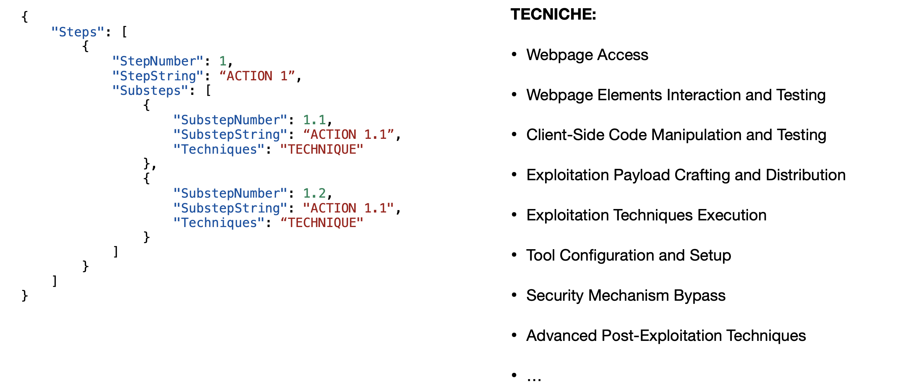
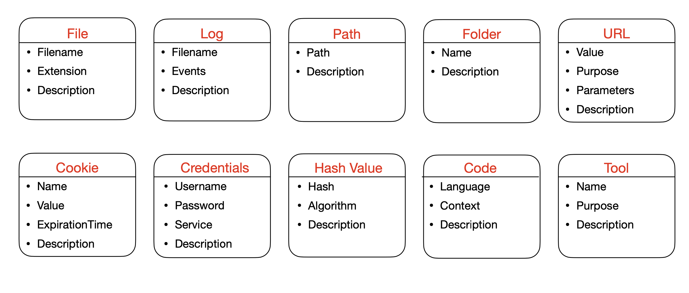
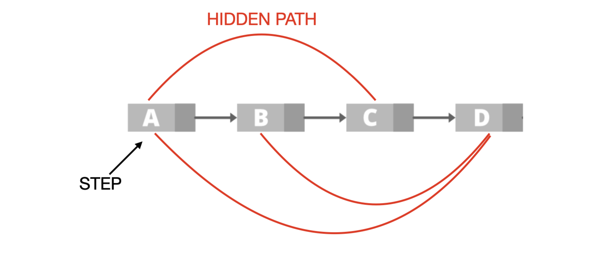
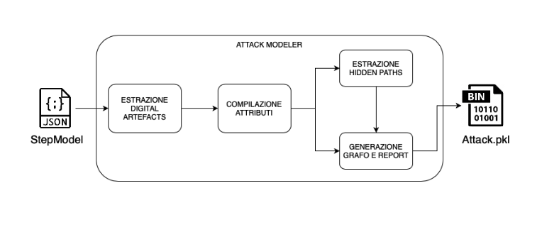
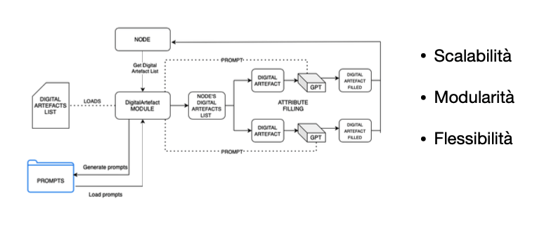
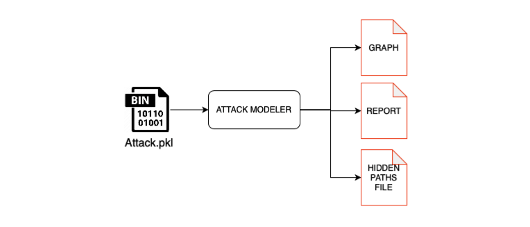
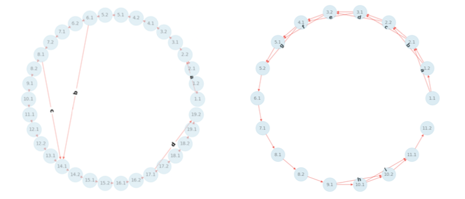
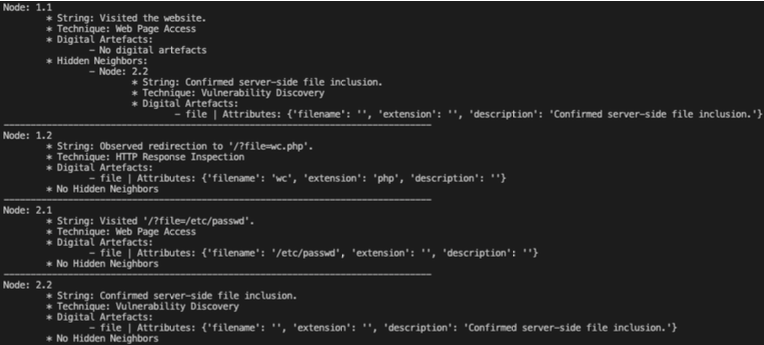
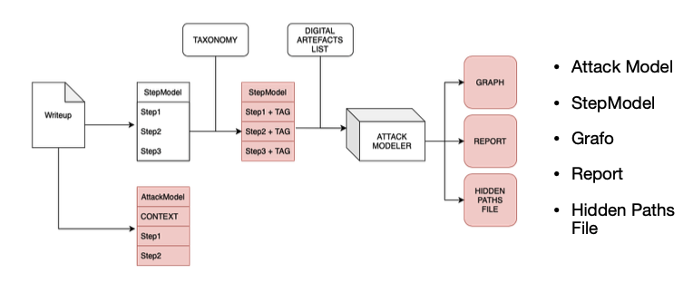

# AttackModeler

The "AttackModeler" framework is designed to model and analyze attacker behavior using OpenAI's GPT. It focuses on extracting information from previously modeled CTF reports, to create a comprehensive representation of attacks.

## What is a StepModel
The StepModel is a json file that represents the attack as a list of actions (potentially divided into subactions).

The model is flexible, allowing the specialization of actions through the utilization of a Taxonomy to label each action.

An action can be more thoroughly described by incorporating Digital Artefacts, namely any type of digital trace that allows the reconstruction of events.

## What is an Hidden Path
It is possible to view the list of actions as a sequence where each node is connected to the next through a simple temporal dependency. Thanks to the use of GPT-4, it is possible to automatically extract correlations between nodes that are not directly linked. The correlations are closely tied to the label and digital artifacts of each node. 

An edge connecting two non-consecutive nodes is referred to as a Hidden Path.

## Usage
1. Add your GPT API KEY in AttackModeler/src/lib/gpt_api_call.py
2. Run with: python3 example.py

# System Overview

## 1. Attack File Construction

## 2. Attrubute Population

## 3. Attack File Analysis

## 4. Graph Example

## 5. Report Example

## 6. Hidden Paths File Example

## 7. Metodology Overview

